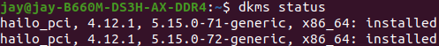
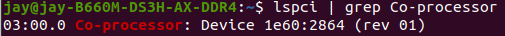

# Install Hailo Pcie driver

# Requirements
* build-essential package (needed to compile the PCIe driver)
* (Optional) bison, flex, libelf-dev and dkms packages (needed to register the PCIe driver using DKMS)
```bash
    sudo apt-get update
    sudo apt-get install build-essential bison flex libelf-dev dkms
```
# Download <pcie_driver>.deb
You can download pcie_driver via [official website](https://hailo.ai/developer-zone/sw-downloads/) . 
Note : `pcie_driver version is 4.12.1`
```bash
    sudo dpkg -i <pcie_driver>.deb
    sudo dpkg -i hailort-pcie-driver_4.12.0_all.deb
```

# Verify

1. dkms status   

     
    
2. To validate that the PCIe driver was installed successfully.
    ```bash
        lspci | grep Co-processor
    ```
     
